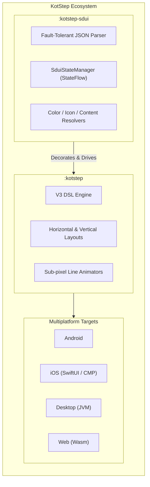

<h1 align="center">KotStep</h1>

<p align="center">
  
  
  
  
  
  
  <a href="https://jitpack.io/#binayshaw7777/KotStep"></a>
  <a href="https://hits.sh/github.com/binayshaw7777/KotStep/"></a>
</p>

<p align="center">
  KotStep is a modern, customizable <strong>Compose Multiplatform</strong> stepper UI and <strong>Server-Driven UI (SDUI)</strong> library.<br/>
  Build dynamic linear workflows, onboarding, checkout, KYC, and order tracking across <strong>Android</strong>, <strong>iOS</strong>, <strong>Desktop</strong>, and <strong>Web</strong> from a single shared codebase.
</p>

<p align="center">
  <a href="https://binayshaw7777.github.io/kotstep"><strong>Documentation Site »</strong></a> ·
  <a href="https://github.com/binayshaw7777/KotStep/issues">Report Bug</a> ·
  <a href="https://github.com/binayshaw7777/KotStep/issues">Request Feature</a>
</p>

<p align="center">
  
</p>

---

## 🌟 Features

- 📱 **True Multiplatform**: 100% shared UI logic across Android, iOS, Desktop (JVM), and Web (Wasm-GC).
- 🧩 **Declarative V3 DSL**: Intuitive, slot-based API (`KotStep`, `step`, leading/trailing label slots).
- 🌐 **Server-Driven UI (`:kotstep-sdui`)**: Render complete steppers directly from backend JSON.
- ⚡ **Optimistic Advancing & Instant Rollback**: Speculative step progression on user tap, with safe rollback on network failure.
- 🔄 **Realtime Dynamic Mutations**: Inject, remove, or patch steps mid-flow via WebSockets, SSE, or push notifications without UI rebuilds.
- 🎨 **Deep Styling & Shapes**: Circle, square, rounded corners, custom shapes, solid/dashed/dotted lines, sub-pixel progress animations.
- ♿ **Accessibility First**: ScreenReader semantics, state descriptions, and 48dp touch targets built in.

---

## 📦 Architecture & Modules



| Module | Purpose | Coordinates |
|---|---|---|
| **`:kotstep`** | Core Compose Multiplatform stepper primitives & DSL | `com.github.binayshaw7777.KotStep:kotstep:3.2.0` |
| **`:kotstep-sdui`** | Server-Driven UI, parser, reactive state machine & mutations | `com.github.binayshaw7777.KotStep:kotstep-sdui:3.2.0` |

---

## 🛠️ Installation

Published via [JitPack](https://jitpack.io/#binayshaw7777/KotStep).

### 1. Add Repository

**`settings.gradle.kts`:**
```kotlin
dependencyResolutionManagement {
    repositories {
        google()
        mavenCentral()
        maven("https://jitpack.io")
    }
}
```

### 2. Add Dependencies

#### Compose Multiplatform (`commonMain`)
```kotlin
// shared/build.gradle.kts
kotlin {
    sourceSets {
        commonMain.dependencies {
            // Core Stepper
            implementation("com.github.binayshaw7777.KotStep:kotstep:3.2.0")

            // Optional: Server-Driven UI
            implementation("com.github.binayshaw7777.KotStep:kotstep-sdui:3.2.0")
        }
    }
}
```

#### Android Single-Platform (`app`)
```kotlin
// app/build.gradle.kts
dependencies {
    implementation("com.github.binayshaw7777.KotStep:kotstep:3.2.0")
    implementation("com.github.binayshaw7777.KotStep:kotstep-sdui:3.2.0")
}
```

---

## 🚀 Quick Start: Core V3 DSL

```kotlin
import androidx.compose.runtime.*
import com.binayshaw7777.kotstep.v3.KotStep
import com.binayshaw7777.kotstep.v3.model.step.StepLayoutStyle
import com.binayshaw7777.kotstep.v3.model.style.KotStepStyle
import com.binayshaw7777.kotstep.v3.util.ExperimentalKotStep

@OptIn(ExperimentalKotStep::class)
@Composable
fun CheckoutStepper() {
    var currentStep by remember { mutableFloatStateOf(0f) }

    KotStep(
        currentStep = { currentStep },
        style = KotStepStyle(stepLayoutStyle = StepLayoutStyle.Horizontal)
    ) {
        step(title = "Cart",    onClick = { currentStep = 0f })
        step(title = "Address", onClick = { currentStep = 1f })
        step(title = "Payment", onClick = { currentStep = 2f })
        step(title = "Review",  onClick = { currentStep = 3f })
    }
}
```

### Leading and Trailing Labels
```kotlin
step(
    icon = Icons.Default.Check,
    leadingLabel = { Text("Step 1", style = MaterialTheme.typography.labelSmall) },
    trailingLabel = {
        Column {
            Text("Order Placed", fontWeight = FontWeight.Bold)
            Text("10:30 AM", color = Color.Gray, style = MaterialTheme.typography.bodySmall)
        }
    }
)
```

---

## 🌐 Quick Start: Server-Driven UI (SDUI)

### 1. 1-Line Drop-in
Render directly from a JSON string returned by your backend API:

```kotlin
KotStepSdui(
    json = apiResponseJson,
    modifier = Modifier.fillMaxWidth().padding(16.dp),
    onStepClick = { stepId ->
        println("Clicked step $stepId")
    }
)
```

### 2. Interactive Flow with Optimistic Advances & Rollback
Manage state reactively with `SduiStateManager`:

```kotlin
@Composable
fun InteractiveCheckout(initialJson: String, viewModel: CheckoutViewModel) {
    val manager = remember { SduiStateManager(initialJson) }
    val flow by manager.flow.collectAsState()

    KotStepSdui(
        manager = manager,
        iconResolver = SduiIconResolver { iconName ->
            when (iconName) {
                "shopping_cart"  -> Icons.Default.ShoppingCart
                "local_shipping" -> Icons.Default.LocalShipping
                "payment"        -> Icons.Default.Payment
                else             -> null
            }
        },
        onStepClick = { stepId ->
            // 1. Optimistic Advance: UI updates immediately
            manager.optimisticAdvance(stepId)

            // 2. Call backend server
            viewModel.submitStep(stepId, onFailure = {
                // 3. Rollback immediately if server validation fails
                manager.rollback()
            })
        }
    )
}
```

### 3. Dynamic Realtime Mutations
Mutate the live stepper tree on the fly (e.g. inject customs inspection, remove obsolete steps):

```kotlin
// Inject a dynamic step after "step_shipping"
manager.applyMutations(
    mutations = listOf(
        SduiMutation.InsertStep(
            step = SduiStep(
                id = "step_customs",
                title = "Customs Declaration",
                subtitle = "International order inspection",
                state = SduiStepState.TODO
            ),
            afterStepId = "step_shipping"
        )
    ),
    newVersion = flow.stateVersion + 1
)
```

### Sample SDUI JSON Flow
```json
{
  "schemaVersion": "1.0",
  "flowId": "checkout_flow",
  "title": "Express Checkout",
  "orientation": "HORIZONTAL",
  "currentStepId": "step_payment",
  "stateVersion": 2,
  "style": {
    "stepStyle": {
      "todo":    { "colorHex": "#475569", "sizeDp": 32, "shape": "CIRCLE" },
      "current": { "colorHex": "#3B82F6", "sizeDp": 36, "shape": "CIRCLE", "borderWidthDp": 2, "borderColorHex": "#1D4ED8" },
      "done":    { "colorHex": "#10B981", "sizeDp": 32, "shape": "CIRCLE" }
    },
    "lineStyle": {
      "done":    { "lineColorHex": "#10B981", "thicknessDp": 3, "lineType": "SOLID" }
    }
  },
  "steps": [
    { "id": "step_cart",     "ordinal": 0, "state": "DONE",    "title": "Cart",     "indicator": { "type": "ICON", "value": "shopping_cart" } },
    { "id": "step_shipping", "ordinal": 1, "state": "DONE",    "title": "Shipping", "indicator": { "type": "ICON", "value": "local_shipping" } },
    { "id": "step_payment",  "ordinal": 2, "state": "CURRENT", "title": "Payment",  "indicator": { "type": "ICON", "value": "payment" } },
    { "id": "step_review",   "ordinal": 3, "state": "TODO",    "title": "Review",   "indicator": { "type": "ICON", "value": "receipt" } }
  ]
}
```
Formal JSON Schema: [docs/kotstep-sdui-schema.json](docs/kotstep-sdui-schema.json).

---

## 🔄 V2 → V3 Migration

> ⚠️ **V2 is Android-only.** The legacy sealed-class API (`HorizontalStepper`, `VerticalStepper`, `tabHorizontal`) is deprecated and Android-only. Migrate to V3 for multiplatform support.

| V2 (Legacy Android-Only) | V3 (Compose Multiplatform) |
|---|---|
| `HorizontalStepper { }` | `KotStep(style = KotStepStyle(stepLayoutStyle = Horizontal)) { }` |
| `currentStep: Int` inside style factory | `currentStep: () -> Float` (supports fractions and animation) |
| Fixed step variants | Unified `step(title / icon / content)` slots |

---

## 💻 Run the Demo App

| Platform | Command |
|---|---|
| **Android** | Run `:app` in Android Studio (includes CMP & SDUI showcase) |
| **Desktop (JVM)** | `./gradlew :desktopApp:run` |
| **Web (Wasm)** | `./gradlew :webApp:wasmJsBrowserDevelopmentRun` (open URL in Chrome 119+ / Firefox 120+) |
| **iOS** | Open `iosApp/iosApp.xcodeproj` in Xcode and run simulator |

---

## 📖 Documentation

Full guides, API references, SDUI specs, and tutorials are available on the documentation site:  
👉 **[https://binayshaw7777.github.io/kotstep](https://binayshaw7777.github.io/kotstep)**

---

## 🤝 Contributing

Contributions, issues, and feature requests are welcome!
- Review [`RULES.md`](RULES.md) and [`AGENTS.md`](AGENTS.md) before submitting pull requests.
- Open an issue on [GitHub Issues](https://github.com/binayshaw7777/KotStep/issues).

---

## 📄 License

```
Copyright 2024 Binay Shaw

Licensed under the Apache License, Version 2.0 (the "License");
you may not use this file except in compliance with the License.
You may obtain a copy of the License at

   http://www.apache.org/licenses/LICENSE-2.0

Unless required by applicable law or agreed to in writing, software
distributed under the License is distributed on an "AS IS" BASIS,
WITHOUT WARRANTIES OR CONDITIONS OF ANY KIND, either express or implied.
See the License for the specific language governing permissions and
limitations under the License.
```
