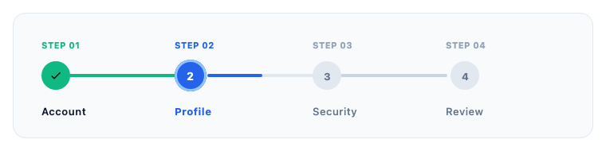
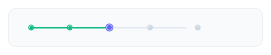
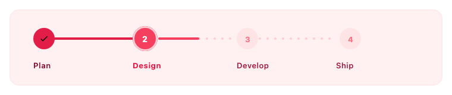
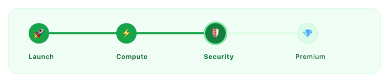
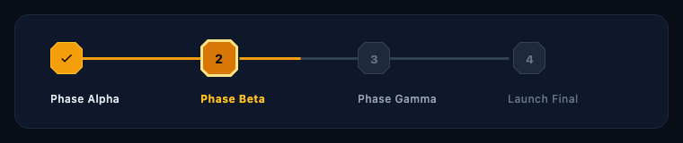
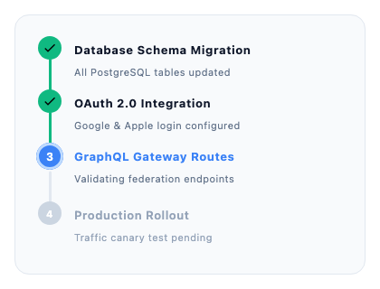
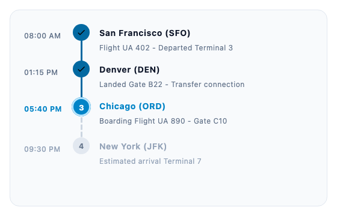
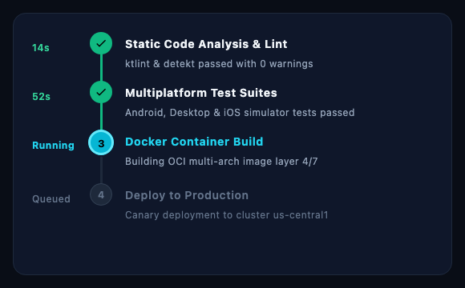
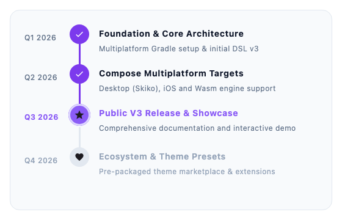
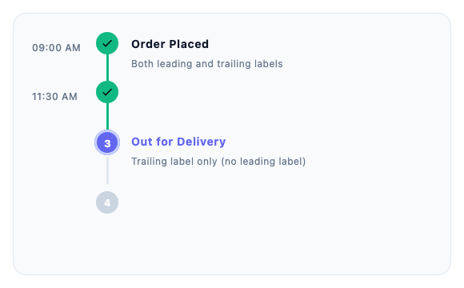

<h1 align="center">KotStep</h1>

<p align="center">
  
  
  
  
  
  
  <a href="https://jitpack.io/#binayshaw7777/KotStep"></a>
  <a href="LICENSE"></a>
</p>

<p align="center">
  <strong>KotStep</strong> is an expressive, high-performance, fully customizable Stepper UI library built natively for <strong>Compose Multiplatform</strong>. Create elegant multi-step workflows, timelines, and progress flows across <strong>Android</strong>, <strong>iOS</strong>, <strong>Desktop (JVM)</strong>, and <strong>Web (Wasm)</strong> from a single shared codebase.
</p>

<p align="center">
  
</p>

---

## ✨ Features

- 🌐 **Compose Multiplatform 100% Native**: Runs seamlessly on Android, iOS, Desktop (JVM), and Web (Wasm).
- ✍️ **Clean V3 DSL**: Intuitive, declarative `KotStep { step(...) }` builder syntax.
- ⚡ **Smooth Fractional Progress**: Animate connecting lines dynamically with continuous `Float` progress values (e.g. `1.5f` = 50% between step 1 and 2).
- 📐 **Horizontal & Vertical Orientations**: Switch layout styles effortlessly with unified indicator and line alignment.
- 🏷️ **Dual Label Slots**: First-class support for `leadingLabel` (e.g. timestamps, step numbers) and `trailingLabel` (e.g. titles, subtitles, cards).
- 🎨 **Deep Visual Customization**: Configure indicator shapes, sizes, colors, stroke caps, borders, and line types (`Solid`, `Dashed`, `Dotted`) per state (`Todo`, `Current`, `Done`).
- 📂 **Collapsible Steps**: Built-in support for accordion-style expandable step content.
- 🛡️ **Zero Android Leakage**: `commonMain` is 100% pure Kotlin & Compose Multiplatform with constraint-safe layout measurement.

---

## 📱 Platform Requirements

| Platform | Minimum Requirement | Runtime Engine |
|---|---|---|
| **Android** | API 24+ (Android 7.0) | Jetpack Compose / ART |
| **iOS** | iOS 16.0+ | Compose Multiplatform (Skiko) |
| **Desktop (JVM)** | Java 17+ | Skia / AWT |
| **Web (Wasm)** | Modern Browser (Chrome 119+, Firefox 120+, Safari 18+) | Kotlin/Wasm GC + Canvas |

---

## 📦 Installation

KotStep is published via [JitPack](https://jitpack.io/#binayshaw7777/KotStep).

### Step 1: Add JitPack repository

Add JitPack to your root `settings.gradle.kts`:

```kotlin
dependencyResolutionManagement {
    repositories {
        google()
        mavenCentral()
        maven("https://jitpack.io")
    }
}
```

### Step 2: Add KotStep dependency

#### Compose Multiplatform (Shared `commonMain`)
```kotlin
// shared/build.gradle.kts or build.gradle.kts in multiplatform module
kotlin {
    sourceSets {
        commonMain.dependencies {
            implementation("com.github.binayshaw7777:KotStep:3.2.0")
        }
    }
}
```

#### Android (Single-Platform)
```kotlin
// app/build.gradle.kts
dependencies {
    implementation("com.github.binayshaw7777:KotStep:3.2.0")
}
```

#### iOS Setup
JitPack distributes Kotlin klibs and metadata. To link the iOS framework from source:
```bash
./gradlew :kotstep:linkReleaseFrameworkIosSimulatorArm64 \
          :kotstep:linkReleaseFrameworkIosArm64 \
          :kotstep:linkReleaseFrameworkIosX64
```
Combine the resulting `.framework` bundles with `xcodebuild -create-xcframework` or consume the shared KMP module directly in Xcode.

---

## 🚀 Quick Start (V3 DSL)

```kotlin
import androidx.compose.runtime.*
import com.binayshaw7777.kotstep.v3.KotStep
import com.binayshaw7777.kotstep.v3.model.step.StepLayoutStyle
import com.binayshaw7777.kotstep.v3.model.style.KotStepStyle
import com.binayshaw7777.kotstep.v3.util.ExperimentalKotStep

@OptIn(ExperimentalKotStep::class)
@Composable
fun CheckoutFlow() {
    var currentStep by remember { mutableFloatStateOf(1f) }

    KotStep(
        currentStep = { currentStep },
        style = KotStepStyle(stepLayoutStyle = StepLayoutStyle.Horizontal)
    ) {
        step(title = "Cart", onClick = { currentStep = 0f })
        step(title = "Shipping", onClick = { currentStep = 1f })
        step(title = "Payment", onClick = { currentStep = 2f })
        step(title = "Review", onClick = { currentStep = 3f })
    }
}
```

---

## 🖼️ Permutations & Combinations Matrix

KotStep provides full orthogonal combinatorics across layouts, indicator shapes, line types, label configurations, and color palettes:

| # | Permutation / Combination | Layout | Indicator Shape | Indicator Content | Line Type | Label Slots | Theme | Preview |
|:---:|---|:---:|:---:|:---:|:---:|:---:|:---:|:---:|
| **1** | **Classic Numbered** | Horizontal | Circle | Numbers (`"1"`) | Solid | Trailing | Light Emerald/Indigo | [View](#1-horizontal-stepper-with-animated-progress) |
| **2** | **Dual Labels** | Horizontal | Circle | Numbers (`"1"`) | Solid | Leading + Trailing | Light Clean | [View](#2-horizontal-dual-labels-top-step--bottom-title) |
| **3** | **Minimalist Dots** | Horizontal | Circle | Default Dot | Solid | None (Minimal) | Light Indigo | [View](#3-horizontal-minimalist-dots-compact-onboarding) |
| **4** | **Dotted Line Track** | Horizontal | Circle | Numbers (`"1"`) | Dotted | Trailing | Rose Sunset | [View](#4-horizontal-dotted-line-track-sunset-theme) |
| **5** | **Dashed Squircle** | Horizontal | RoundedCorner | Letters (`"A"`) | Dashed | Trailing | Warm Amber | [View](#5-horizontal-dashed-line--squircle-badges) |
| **6** | **Vector Icons** | Horizontal | Circle | `ImageVector` | Solid | Trailing | Royal Purple | [View](#6-horizontal-vector-icons--state-colors) |
| **7** | **Custom Composable** | Horizontal | Circle | Composable / Emojis | Solid | Trailing | Emerald Green | [View](#7-horizontal-custom-composable-badges--emojis) |
| **8** | **Cut-Corner Geometric** | Horizontal | CutCorner | Numbers (`"1"`) | Solid | Trailing | Cyberpunk Dark | [View](#8-horizontal-cut-corner-geometric-shape-cyberpunk--gold) |
| **9** | **Fintech Dark Mode** | Horizontal | Circle | Numbers (`"1"`) | Solid | Trailing | Obsidian Cyan | [View](#9-horizontal-dark-fintech-stepper) |
| **10** | **Delivery Timeline** | Vertical | Circle | Numbers / Checkmarks | Solid | Leading + Trailing | Light Slate | [View](#10-vertical-timeline-with-dual-label-slots) |
| **11** | **Minimal Activity Rail** | Vertical | Circle | Numbers / Checkmarks | Solid | Trailing only | Light Slate | [View](#11-vertical-minimal-activity-rail-no-timestamps) |
| **12** | **Dashed Transit Route** | Vertical | Circle | Numbers / Checkmarks | Dashed | Leading + Trailing | Sky Blue | [View](#12-vertical-dashed-flight-transit-route) |
| **13** | **Dark CI/CD Pipeline** | Vertical | Circle | Numbers / Checkmarks | Solid | Leading + Trailing | Terminal Dark | [View](#13-vertical-dark-mode-cicd-pipeline) |
| **14** | **Interactive Collapsible**| Vertical | Circle | Numbers / Checkmarks | Solid | Trailing (Collapsible) | Mint Teal | [View](#14-vertical-interactive-collapsible-stepper) |
| **15** | **Roadmap Milestones** | Vertical | Circle | `ImageVector` | Solid | Leading + Trailing | Violet Purple | [View](#15-vertical-milestone-roadmap-with-vector-icons) |
| **16** | **Mixed Slot Permutations** | Vertical | Circle | Numbers / Checkmarks | Solid | Both, Leading-only, Trailing-only, None | Light Slate | [View](#16-vertical-timeline-with-mixed-slot-combinations) |

---

## 🎨 Visual Showcase & Code Snippets

### 1. Horizontal Stepper with Animated Progress

Clean multi-step horizontal navigation with custom status colors, active rings, and fractional progress line interpolation.

<p align="center">
  
</p>

```kotlin
KotStep(
    currentStep = { 1.5f }, // 50% animated progress between step 1 and step 2
    style = KotStepStyle(stepLayoutStyle = StepLayoutStyle.Horizontal)
) {
    step(title = "1", trailingLabel = { Text("Cart") })
    step(title = "2", trailingLabel = { Text("Shipping") })
    step(title = "3", trailingLabel = { Text("Payment") })
    step(title = "4", trailingLabel = { Text("Review") })
}
```

<details>
<summary><b>🔍 See snippet & options</b></summary>

> **File:** [`HorizontalStepperSnippets.kt`](demo/src/commonMain/kotlin/com/binayshaw7777/kotstep/demo/snippets/HorizontalStepperSnippets.kt)

```kotlin
@OptIn(ExperimentalKotStep::class)
@Composable
fun HorizontalCheckoutSnippet() {
    var step by remember { mutableFloatStateOf(1.5f) }

    KotStep(
        currentStep = { step },
        style = KotStepStyle(
            stepLayoutStyle = StepLayoutStyle.Horizontal,
            stepStyle = StepStyles.default().copy(
                onTodo = StepStyle(stepSize = 36.dp, stepColor = Color(0xFFE2E8F0)),
                onCurrent = StepStyle(
                    stepSize = 40.dp,
                    stepColor = Color(0xFF2563EB),
                    borderStyle = BorderStyle(width = 3.dp, color = Color(0xFF93C5FD))
                ),
                onDone = StepStyle(stepSize = 36.dp, stepColor = Color(0xFF10B981))
            ),
            lineStyle = LineStyles.default().copy(
                onCurrent = LineStyle(
                    lineLength = 130.dp,
                    lineThickness = 4.dp,
                    lineColor = Color(0xFFE2E8F0),
                    progressColor = Color(0xFF2563EB),
                    lineStrokeCap = StrokeCap.Round,
                    progressStrokeCap = StrokeCap.Round
                )
            )
        )
    ) {
        step(title = "1", trailingLabel = { Text("Cart") })
        step(title = "2", trailingLabel = { Text("Shipping") })
        step(title = "3", trailingLabel = { Text("Payment") })
        step(title = "4", trailingLabel = { Text("Review") })
    }
}
```

</details>

---

### 2. Horizontal Dual Labels (Top Step + Bottom Title)

Utilizes both `leadingLabel` (positioned above indicator) and `trailingLabel` (positioned below indicator) for structured enterprise checkout flows.

<p align="center">
  
</p>

```kotlin
KotStep(
    currentStep = { 1.5f },
    style = KotStepStyle(stepLayoutStyle = StepLayoutStyle.Horizontal)
) {
    step(
        title = "1",
        leadingLabel = { Text("STEP 01", fontSize = 11.sp, fontWeight = FontWeight.Bold) },
        trailingLabel = { Text("Account", fontSize = 13.sp) }
    )
    step(
        title = "2",
        leadingLabel = { Text("STEP 02", fontSize = 11.sp, fontWeight = FontWeight.Bold) },
        trailingLabel = { Text("Profile", fontSize = 13.sp) }
    )
}
```

<details>
<summary><b>🔍 See snippet & options</b></summary>

> **File:** [`HorizontalStepperSnippets.kt`](demo/src/commonMain/kotlin/com/binayshaw7777/kotstep/demo/snippets/HorizontalStepperSnippets.kt) (`HorizontalDualLabelSnippet`)

</details>

---

### 3. Horizontal Minimalist Dots (Compact Onboarding)

No text labels, pure compact pagination/onboarding dots with animated active indicator ring.

<p align="center">
  
</p>

```kotlin
KotStep(
    currentStep = { 2f },
    style = KotStepStyle(
        stepLayoutStyle = StepLayoutStyle.Horizontal,
        showCheckMarkOnDone = false,
        stepStyle = StepStyles.default().copy(
            onTodo = StepStyle(stepSize = 12.dp, stepColor = Color(0xFFCBD5E1)),
            onCurrent = StepStyle(stepSize = 16.dp, stepColor = Color(0xFF6366F1), borderStyle = BorderStyle(3.dp, Color(0xFFC7D2FE))),
            onDone = StepStyle(stepSize = 12.dp, stepColor = Color(0xFF10B981))
        ),
        lineStyle = LineStyles.default().copy(
            onCurrent = LineStyle(lineLength = 64.dp, lineThickness = 3.dp)
        )
    )
) {
    step(); step(); step(); step(); step()
}
```

<details>
<summary><b>🔍 See snippet & options</b></summary>

> **File:** [`HorizontalStepperSnippets.kt`](demo/src/commonMain/kotlin/com/binayshaw7777/kotstep/demo/snippets/HorizontalStepperSnippets.kt) (`MinimalistDotsSnippet`)

</details>

---

### 4. Horizontal Dotted Line Track (Sunset Theme)

Demonstrates `LineType.Dotted(gapLength = 8.dp)` with `StrokeCap.Round` for modern, airy progress tracks.

<p align="center">
  
</p>

```kotlin
KotStep(
    currentStep = { 1.5f },
    style = KotStepStyle(
        stepLayoutStyle = StepLayoutStyle.Horizontal,
        lineStyle = LineStyles.default().copy(
            onCurrent = LineStyle(lineType = LineType.Dotted(gapLength = 8.dp), progressColor = Color(0xFFF43F5E))
        )
    )
) {
    step(title = "1", trailingLabel = { Text("Plan") })
    step(title = "2", trailingLabel = { Text("Design") })
    step(title = "3", trailingLabel = { Text("Develop") })
    step(title = "4", trailingLabel = { Text("Ship") })
}
```

<details>
<summary><b>🔍 See snippet & options</b></summary>

> **File:** [`LineStylingSnippets.kt`](demo/src/commonMain/kotlin/com/binayshaw7777/kotstep/demo/snippets/LineStylingSnippets.kt)

</details>

---

### 5. Horizontal Dashed Line & Squircle Badges

Combine `RoundedCornerShape` with `LineType.Dashed(dashLength, gapLength)` for industrial, roadmapped stages.

<p align="center">
  
</p>

```kotlin
KotStep(
    currentStep = { 1f },
    style = KotStepStyle(
        stepLayoutStyle = StepLayoutStyle.Horizontal,
        stepStyle = StepStyles.default().copy(
            onCurrent = StepStyle(stepShape = RoundedCornerShape(12.dp), stepColor = Color(0xFFF59E0B)),
            onDone = StepStyle(stepShape = RoundedCornerShape(10.dp), stepColor = Color(0xFFD97706))
        ),
        lineStyle = LineStyles.default().copy(
            onCurrent = LineStyle(lineType = LineType.Dashed(dashLength = 8.dp, gapLength = 6.dp))
        )
    )
) {
    step(title = "A", trailingLabel = { Text("Plan") })
    step(title = "B", trailingLabel = { Text("Build") })
    step(title = "C", trailingLabel = { Text("Test") })
    step(title = "D", trailingLabel = { Text("Deploy") })
}
```

<details>
<summary><b>🔍 See snippet & options</b></summary>

> **File:** [`LineStylingSnippets.kt`](demo/src/commonMain/kotlin/com/binayshaw7777/kotstep/demo/snippets/LineStylingSnippets.kt)

</details>

---

### 6. Horizontal Vector Icons & State Colors

Replace numbers with Compose `ImageVector` icons and configure distinct icon tints and sizes across states.

<p align="center">
  
</p>

```kotlin
KotStep(
    currentStep = { 2f },
    style = KotStepStyle(stepLayoutStyle = StepLayoutStyle.Horizontal)
) {
    step(icon = Icons.Default.Home, trailingLabel = { Text("Start") })
    step(icon = Icons.Default.Person, trailingLabel = { Text("Profile") })
    step(icon = Icons.Default.Star, trailingLabel = { Text("Perks") })
    step(icon = Icons.Default.Favorite, trailingLabel = { Text("Done") })
}
```

<details>
<summary><b>🔍 See snippet & options</b></summary>

> **File:** [`CustomIndicatorSnippets.kt`](demo/src/commonMain/kotlin/com/binayshaw7777/kotstep/demo/snippets/CustomIndicatorSnippets.kt) (`VectorIconStepperSnippet`)

</details>

---

### 7. Horizontal Custom Composable Badges & Emojis

Pass arbitrary Compose UI inside `content = { ... }` to display badges, custom animated spinners, or emojis.

<p align="center">
  
</p>

```kotlin
KotStep(
    currentStep = { 2f },
    style = KotStepStyle(stepLayoutStyle = StepLayoutStyle.Horizontal, showCheckMarkOnDone = false)
) {
    step(content = { Text("🚀", fontSize = 16.sp) }, trailingLabel = { Text("Launch") })
    step(content = { Text("⚡", fontSize = 16.sp) }, trailingLabel = { Text("Compute") })
    step(content = { Text("🛡️", fontSize = 16.sp) }, trailingLabel = { Text("Security") })
    step(content = { Text("💎", fontSize = 16.sp) }, trailingLabel = { Text("Premium") })
}
```

<details>
<summary><b>🔍 See snippet & options</b></summary>

> **File:** [`CustomIndicatorSnippets.kt`](demo/src/commonMain/kotlin/com/binayshaw7777/kotstep/demo/snippets/CustomIndicatorSnippets.kt) (`ComposableContentStepperSnippet`)

</details>

---

### 8. Horizontal Cut-Corner Geometric Shape (Cyberpunk / Gold)

Demonstrates `CutCornerShape(8.dp)` with high-contrast active borders for sci-fi, gaming, or angular enterprise aesthetics.

<p align="center">
  
</p>

```kotlin
KotStep(
    currentStep = { 1.5f },
    style = KotStepStyle(
        stepLayoutStyle = StepLayoutStyle.Horizontal,
        stepStyle = StepStyles.default().copy(
            onCurrent = StepStyle(stepShape = CutCornerShape(8.dp), stepColor = Color(0xFFD97706), borderStyle = BorderStyle(3.dp, Color(0xFFFDE68A))),
            onDone = StepStyle(stepShape = CutCornerShape(8.dp), stepColor = Color(0xFFF59E0B))
        )
    )
) {
    step(title = "1", trailingLabel = { Text("Phase Alpha") })
    step(title = "2", trailingLabel = { Text("Phase Beta") })
    step(title = "3", trailingLabel = { Text("Phase Gamma") })
    step(title = "4", trailingLabel = { Text("Launch Final") })
}
```

<details>
<summary><b>🔍 See snippet & options</b></summary>

> **File:** [`CustomIndicatorSnippets.kt`](demo/src/commonMain/kotlin/com/binayshaw7777/kotstep/demo/snippets/CustomIndicatorSnippets.kt) (`CutCornerGamingSnippet`)

</details>

---

### 9. Horizontal Dark Fintech Stepper

Dark mode theme with deep obsidian slate and electric cyan highlights, built for KYC verification.

<p align="center">
  
</p>

```kotlin
KotStep(
    currentStep = { 1.3f },
    style = KotStepStyle(
        stepLayoutStyle = StepLayoutStyle.Horizontal,
        stepStyle = StepStyles.default().copy(
            onTodo = StepStyle(stepColor = Color(0xFF334155)),
            onCurrent = StepStyle(stepColor = Color(0xFF0284C7), borderStyle = BorderStyle(3.dp, Color(0xFF38BDF8))),
            onDone = StepStyle(stepColor = Color(0xFF10B981))
        )
    )
) {
    step(title = "1", trailingLabel = { Text("Personal Info") })
    step(title = "2", trailingLabel = { Text("National ID") })
    step(title = "3", trailingLabel = { Text("Facial Scan") })
    step(title = "4", trailingLabel = { Text("Confirmation") })
}
```

<details>
<summary><b>🔍 See snippet & options</b></summary>

> **File:** [`ThemingSnippets.kt`](demo/src/commonMain/kotlin/com/binayshaw7777/kotstep/demo/snippets/ThemingSnippets.kt) (`FintechDarkThemeSnippet`)

</details>

---

### 10. Vertical Timeline with Dual Label Slots

Display delivery tracking and timeline histories using `leadingLabel` for timestamps and `trailingLabel` for rich descriptions. Perfectly aligned single-axis vertical connecting line.

<p align="center">
  
</p>

```kotlin
KotStep(
    currentStep = { 2f },
    style = KotStepStyle(stepLayoutStyle = StepLayoutStyle.Vertical)
) {
    step(
        title = "1",
        leadingLabel = { Text("09:30 AM", fontSize = 12.sp, color = Color.Gray) },
        trailingLabel = { Text("Order Placed", fontWeight = FontWeight.Bold) }
    )
    step(
        title = "2",
        leadingLabel = { Text("11:15 AM", fontSize = 12.sp, color = Color.Gray) },
        trailingLabel = { Text("Package Packed", fontWeight = FontWeight.Bold) }
    )
    step(
        title = "3",
        leadingLabel = { Text("02:45 PM", fontSize = 12.sp, fontWeight = FontWeight.Bold, color = Color(0xFF6366F1)) },
        trailingLabel = { Text("Out for Delivery", fontWeight = FontWeight.Bold, color = Color(0xFF6366F1)) }
    )
    step(
        title = "4",
        leadingLabel = { Text("Estimated", fontSize = 12.sp, color = Color.LightGray) },
        trailingLabel = { Text("Delivered", color = Color.LightGray) }
    )
}
```

<details>
<summary><b>🔍 See snippet & options</b></summary>

> **File:** [`VerticalTimelineSnippets.kt`](demo/src/commonMain/kotlin/com/binayshaw7777/kotstep/demo/snippets/VerticalTimelineSnippets.kt) (`DeliveryTrackingTimelineSnippet`)

</details>

---

### 11. Vertical Minimal Activity Rail (No Timestamps)

Compact vertical indicator rail without leading timestamps, ideal for task lists and setup checklists.

<p align="center">
  
</p>

```kotlin
KotStep(
    currentStep = { 2f },
    style = KotStepStyle(stepLayoutStyle = StepLayoutStyle.Vertical)
) {
    step(title = "1", trailingLabel = { Text("Database Schema Migration") })
    step(title = "2", trailingLabel = { Text("OAuth 2.0 Integration") })
    step(title = "3", trailingLabel = { Text("GraphQL Gateway Routes") })
    step(title = "4", trailingLabel = { Text("Production Rollout") })
}
```

<details>
<summary><b>🔍 See snippet & options</b></summary>

> **File:** [`VerticalTimelineSnippets.kt`](demo/src/commonMain/kotlin/com/binayshaw7777/kotstep/demo/snippets/VerticalTimelineSnippets.kt) (`VerticalMinimalRailSnippet`)

</details>

---

### 12. Vertical Dashed Flight Transit Route

Demonstrates a vertical travel / logistics shipping route using `LineType.Dashed`.

<p align="center">
  
</p>

```kotlin
KotStep(
    currentStep = { 2f },
    style = KotStepStyle(
        stepLayoutStyle = StepLayoutStyle.Vertical,
        lineStyle = LineStyles.default().copy(
            onCurrent = LineStyle(lineType = LineType.Dashed(dashLength = 6.dp, gapLength = 6.dp))
        )
    )
) {
    step(title = "1", leadingLabel = { Text("08:00 AM") }, trailingLabel = { Text("San Francisco (SFO)") })
    step(title = "2", leadingLabel = { Text("01:15 PM") }, trailingLabel = { Text("Denver (DEN)") })
    step(title = "3", leadingLabel = { Text("05:40 PM") }, trailingLabel = { Text("Chicago (ORD)") })
    step(title = "4", leadingLabel = { Text("09:30 PM") }, trailingLabel = { Text("New York (JFK)") })
}
```

<details>
<summary><b>🔍 See snippet & options</b></summary>

> **File:** [`VerticalTimelineSnippets.kt`](demo/src/commonMain/kotlin/com/binayshaw7777/kotstep/demo/snippets/VerticalTimelineSnippets.kt) (`VerticalDashedRouteSnippet`)

</details>

---

### 13. Vertical Dark Mode CI/CD Pipeline

Dark DevOps build/deploy timeline with duration badges, execution states, and terminal colorway.

<p align="center">
  
</p>

```kotlin
KotStep(
    currentStep = { 2f },
    style = KotStepStyle(
        stepLayoutStyle = StepLayoutStyle.Vertical,
        stepStyle = StepStyles.default().copy(
            onCurrent = StepStyle(stepColor = Color(0xFF06B6D4), borderStyle = BorderStyle(3.dp, Color(0xFF67E8F9))),
            onDone = StepStyle(stepColor = Color(0xFF10B981))
        )
    )
) {
    step(title = "1", leadingLabel = { Text("14s") }, trailingLabel = { Text("Static Code Analysis") })
    step(title = "2", leadingLabel = { Text("52s") }, trailingLabel = { Text("Multiplatform Tests") })
    step(title = "3", leadingLabel = { Text("Running") }, trailingLabel = { Text("Docker Build") })
    step(title = "4", leadingLabel = { Text("Queued") }, trailingLabel = { Text("Deploy Prod") })
}
```

<details>
<summary><b>🔍 See snippet & options</b></summary>

> **File:** [`ThemingSnippets.kt`](demo/src/commonMain/kotlin/com/binayshaw7777/kotstep/demo/snippets/ThemingSnippets.kt) (`VerticalDarkPipelineSnippet`)

</details>

---

### 14. Vertical Interactive Collapsible Stepper

Tapping a step expands/collapses its trailing content dynamically with animated transitions.

<p align="center">
  
</p>

```kotlin
step(
    title = "2",
    isCollapsible = true, // Tapping indicator or row toggles visibility
    trailingLabel = {
        Column {
            Text("Subscription Plan (Expanded)", fontWeight = FontWeight.Bold)
            Card { Text("Pro Plan — $19/month") }
        }
    }
)
```

<details>
<summary><b>🔍 See snippet & options</b></summary>

> **File:** [`CollapsibleStepSnippets.kt`](demo/src/commonMain/kotlin/com/binayshaw7777/kotstep/demo/snippets/CollapsibleStepSnippets.kt) (`CollapsibleOrderDetailsSnippet`)

</details>

---

### 15. Vertical Milestone Roadmap with Vector Icons

Display quarterly product or project roadmap milestones using custom `ImageVector` icons per step.

<p align="center">
  
</p>

```kotlin
KotStep(
    currentStep = { 2f },
    style = KotStepStyle(stepLayoutStyle = StepLayoutStyle.Vertical)
) {
    step(icon = Icons.Default.Home, leadingLabel = { Text("Q1 2026") }, trailingLabel = { Text("Architecture") })
    step(icon = Icons.Default.Person, leadingLabel = { Text("Q2 2026") }, trailingLabel = { Text("CMP Targets") })
    step(icon = Icons.Default.Star, leadingLabel = { Text("Q3 2026") }, trailingLabel = { Text("V3 Release") })
    step(icon = Icons.Default.Favorite, leadingLabel = { Text("Q4 2026") }, trailingLabel = { Text("Ecosystem") })
}
```

<details>
<summary><b>🔍 See snippet & options</b></summary>

> **File:** [`CustomIndicatorSnippets.kt`](demo/src/commonMain/kotlin/com/binayshaw7777/kotstep/demo/snippets/CustomIndicatorSnippets.kt) (`VerticalMilestoneIconsSnippet`)

</details>

---

### 16. Vertical Timeline with Mixed Slot Combinations

Demonstrates dynamic slot variations across steps in a single timeline — Step 1 with both labels, Step 2 with leading only, Step 3 with trailing only, and Step 4 with indicator only. The layout engine reserves slot width dynamically, keeping the indicator column and connecting line 100% straight.

<p align="center">
  
</p>

```kotlin
KotStep(
    currentStep = { 2f },
    style = KotStepStyle(stepLayoutStyle = StepLayoutStyle.Vertical)
) {
    // 1. Both leading and trailing label
    step(
        title = "1",
        leadingLabel = { Text("09:00 AM", fontSize = 12.sp, color = Color.Gray) },
        trailingLabel = { Text("Order Placed", fontWeight = FontWeight.Bold) }
    )

    // 2. Just leading label (no trailing label)
    step(
        title = "2",
        leadingLabel = { Text("11:30 AM", fontSize = 12.sp, color = Color.Gray) }
    )

    // 3. Just trailing label (no leading label)
    step(
        title = "3",
        trailingLabel = { Text("Out for Delivery", fontWeight = FontWeight.Bold, color = Color(0xFF6366F1)) }
    )

    // 4. None (indicator only, no labels)
    step(
        title = "4"
    )
}
```

<details>
<summary><b>🔍 See snippet & options</b></summary>

> **File:** [`VerticalTimelineSnippets.kt`](demo/src/commonMain/kotlin/com/binayshaw7777/kotstep/demo/snippets/VerticalTimelineSnippets.kt) (`VerticalMixedSlotsSnippet`)

</details>


---

## 📖 Complete API Reference

### `KotStep` Composable

```kotlin
@ExperimentalKotStep
@Composable
fun KotStep(
    modifier: Modifier = Modifier,
    currentStep: () -> Float,
    style: KotStepStyle = KotStepStyle(),
    content: KotStepScope.() -> Unit
)
```

| Parameter | Type | Default | Description |
|---|---|---|---|
| `modifier` | `Modifier` | `Modifier` | Layout modifier applied to the stepper root container. |
| `currentStep` | `() -> Float` | *Required* | Lambda providing active step index as a `Float`. Supports fractional values for smooth line transitions. |
| `style` | `KotStepStyle` | `KotStepStyle()` | Comprehensive styling options for indicators, lines, layout, and states. |
| `content` | `KotStepScope.() -> Unit` | *Required* | DSL scope for declaring individual steps via `step(...)`. |

---

### `KotStepScope.step()` Variants

Declare steps inside `KotStep` using three overloaded variants:

```kotlin
// 1. Text or numbered step
step(
    title: String,
    leadingLabel: @Composable () -> Unit = {},
    trailingLabel: @Composable () -> Unit = {},
    isCollapsible: Boolean = false,
    onClick: (() -> Unit) = {},
    onDone: (() -> Unit) = {}
)

// 2. Icon step
step(
    icon: ImageVector,
    leadingLabel: @Composable () -> Unit = {},
    trailingLabel: @Composable () -> Unit = {},
    isCollapsible: Boolean = false,
    onClick: (() -> Unit) = {},
    onDone: (() -> Unit) = {}
)

// 3. Fully custom composable indicator
step(
    content: (@Composable () -> Unit)? = null,
    leadingLabel: @Composable () -> Unit = {},
    trailingLabel: @Composable () -> Unit = {},
    isCollapsible: Boolean = false,
    onClick: (() -> Unit) = {},
    onDone: (() -> Unit) = {}
)
```

---

### `currentStep` State & Progress Semantics

KotStep uses a continuous `Float` progress model:

```kotlin
-1.0f  // All steps are Todo; all lines empty
 0.0f  // Step 0 is Current; Step 1+ are Todo; Line 0 progress is 0%
 0.5f  // Step 0 is Current; Line between 0 and 1 is 50% animated
 1.0f  // Step 0 is Done; Step 1 is Current; Line 0 is 100% completed
 3.0f  // Steps 0, 1, 2 are Done; Step 3 is Current
 4.0f  // For 4 steps: All steps (0..3) marked Done; all lines 100% completed
```

---

### Style Configuration Objects

#### `KotStepStyle`
```kotlin
data class KotStepStyle(
    val stepLayoutStyle: StepLayoutStyle = StepLayoutStyle.Vertical,
    val itemPadding: Dp = 8.dp,
    val showCheckMarkOnDone: Boolean = true,
    val ignoreCurrentState: Boolean = false,
    val stepStyle: StepStyles = StepStyles.default(),
    val lineStyle: LineStyles = LineStyles.default()
)
```

#### `StepStyle`
```kotlin
data class StepStyle(
    val stepColor: Color = Color.Gray,
    val stepSize: Dp = 24.dp,
    val stepShape: Shape = CircleShape,
    val textStyle: TextStyle = TextStyle(color = Color.Black, fontSize = 16.sp),
    val iconStyle: IconStyle = IconStyle(),
    val borderStyle: BorderStyle = BorderStyle()
)
```

#### `LineStyle` & `LineType`
```kotlin
data class LineStyle(
    val lineColor: Color = Color.Gray,
    val progressColor: Color = Color.Green,
    val lineLength: Dp = 16.dp,
    val lineThickness: Dp = 2.dp,
    val linePadding: PaddingValues = PaddingValues(0.dp),
    val lineStrokeCap: StrokeCap = StrokeCap.Square,
    val progressStrokeCap: StrokeCap = StrokeCap.Square,
    val lineType: LineType = LineType.Solid,
    val progressType: LineType = LineType.Solid
)
```

Supported `LineType` variants:
- `LineType.Solid`: Continuous line.
- `LineType.Dashed(dashLength: Dp = 1.dp, gapLength: Dp = 15.dp)`: Dashed pattern.
- `LineType.Dotted(gapLength: Dp = 8.dp)`: Dotted pattern.

---

> 💡 **Migrating from KotStep V2?** KotStep V3 is a full multiplatform rewrite with an expressive declarative DSL. See the dedicated [V2 → V3 Migration Guide](docs/v2-to-v3-migration.md) for complete side-by-side diffs and class mapping tables.

---

## 🏃 Running the Demo Apps

KotStep includes a shared multiplatform demo application with interactive playgrounds:

```bash
# Run Desktop (JVM) Demo
./gradlew :desktopApp:run

# Run Web (Wasm) Demo
./gradlew :webApp:wasmJsBrowserDevelopmentRun

# Run Android Demo
Open in Android Studio and run the 'app' configuration

# Run iOS Demo
Open 'iosApp/iosApp.xcodeproj' in Xcode and run on any iOS Simulator
```

---

## 🧪 Verification & Off-Screen Previews

```bash
# Run multiplatform unit & UI tests on Desktop JVM
./gradlew :kotstep:desktopTest

# Re-export high-resolution component preview PNGs to docs/images/
./gradlew :kotstep:desktopTest --tests "com.binayshaw7777.kotstep.v3.KotStepExportPreviewsTest"
```

---

## 👤 Author & Maintenance

KotStep is a personal library developed and maintained by [Binay Shaw](https://github.com/binayshaw7777). External contributions and pull requests are not accepted. Feel free to fork or report issues via [GitHub Issues](https://github.com/binayshaw7777/KotStep/issues).

## 📄 License

```
Copyright 2024 Binay Shaw

Licensed under the Apache License, Version 2.0 (the "License");
you may not use this file except in compliance with the License.
You may obtain a copy of the License at

   http://www.apache.org/licenses/LICENSE-2.0

Unless required by applicable law or agreed to in writing, software
distributed under the License is distributed on an "AS IS" BASIS,
WITHOUT WARRANTIES OR CONDITIONS OF ANY KIND, either express or implied.
See the License for the specific language governing permissions and
limitations under the License.
```
