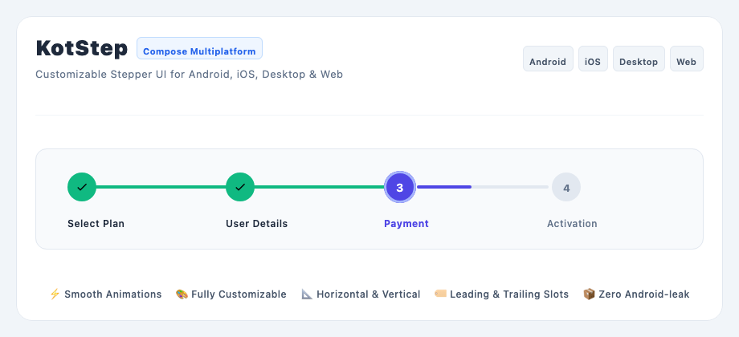
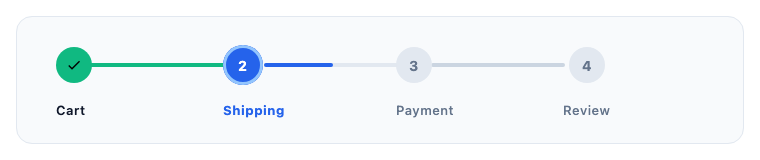
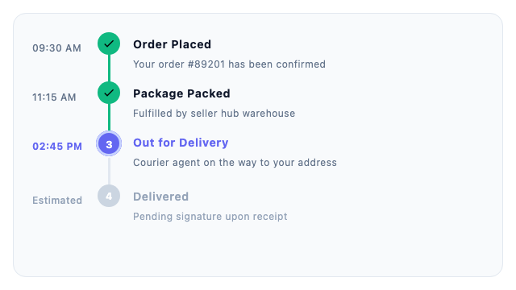
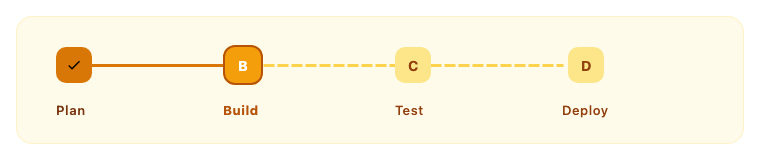
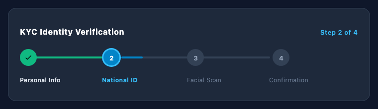
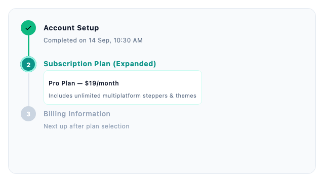

# KotStep (Compose Multiplatform)

**KotStep** is an expressive, high-performance, fully customizable Stepper UI library built natively for **Compose Multiplatform**. Create elegant multi-step workflows, timelines, and progress flows across **Android**, **iOS**, **Desktop (JVM)**, and **Web (Wasm)** from a single shared codebase.



## Overview

- 🌐 **Compose Multiplatform 100% Native**: Runs seamlessly on Android, iOS, Desktop (JVM), and Web (Wasm).
- ✍️ **Clean V3 DSL**: Intuitive, declarative `KotStep { step(...) }` builder syntax.
- ⚡ **Smooth Fractional Progress**: Animate connecting lines dynamically with continuous `Float` progress values.
- 📐 **Horizontal & Vertical Orientations**: Switch layout styles effortlessly with unified indicator and line alignment.
- 🏷️ **Dual Label Slots**: First-class support for `leadingLabel` and `trailingLabel`.
- 🎨 **Deep Visual Customization**: Configure indicator shapes, sizes, colors, stroke caps, borders, and line types (`Solid`, `Dashed`, `Dotted`) per state (`Todo`, `Current`, `Done`).
- 📂 **Collapsible Steps**: Built-in support for accordion-style expandable step content.

---

## Quick Start

```kotlin
import androidx.compose.runtime.*
import com.binayshaw7777.kotstep.v3.KotStep
import com.binayshaw7777.kotstep.v3.model.step.StepLayoutStyle
import com.binayshaw7777.kotstep.v3.model.style.KotStepStyle
import com.binayshaw7777.kotstep.v3.util.ExperimentalKotStep

@OptIn(ExperimentalKotStep::class)
@Composable
fun CheckoutFlow() {
    var currentStep by remember { mutableFloatStateOf(1f) }

    KotStep(
        currentStep = { currentStep },
        style = KotStepStyle(stepLayoutStyle = StepLayoutStyle.Horizontal)
    ) {
        step(title = "Cart", onClick = { currentStep = 0f })
        step(title = "Shipping", onClick = { currentStep = 1f })
        step(title = "Payment", onClick = { currentStep = 2f })
        step(title = "Review", onClick = { currentStep = 3f })
    }
}
```

---

## Visual Previews

### Horizontal Stepper


### Vertical Timeline


### Custom Icons


### Dashed Lines & Custom Shapes


### Dark Fintech Theme


### Collapsible Steps


---

## Installation

Add JitPack to your root `settings.gradle.kts`:

```kotlin
dependencyResolutionManagement {
    repositories {
        google()
        mavenCentral()
        maven("https://jitpack.io")
    }
}
```

Add dependency to `commonMain`:

```kotlin
kotlin {
    sourceSets {
        commonMain.dependencies {
            implementation("com.github.binayshaw7777:KotStep:3.2.0")
        }
    }
}
```

---

## Migration

Migrating from the legacy Android-only V2 library? Check out the [V2 to V3 Migration Guide](v2-to-v3-migration.md).

