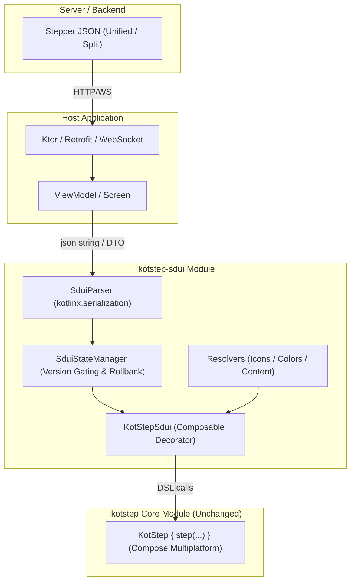
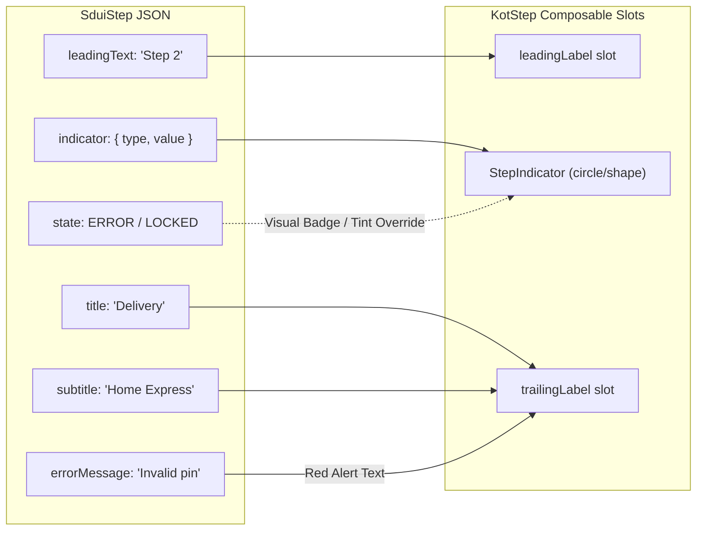
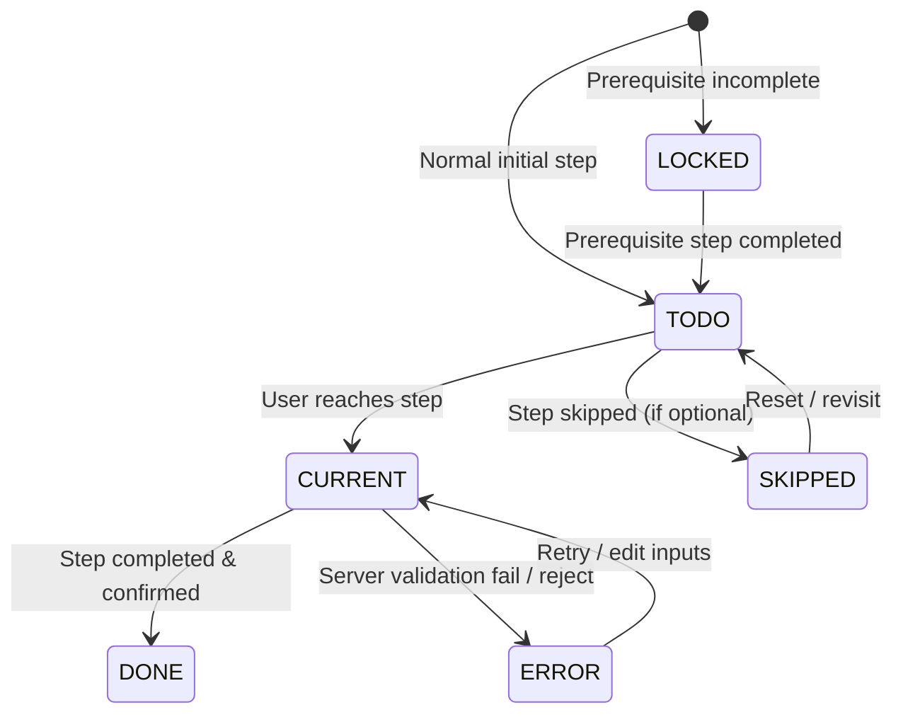
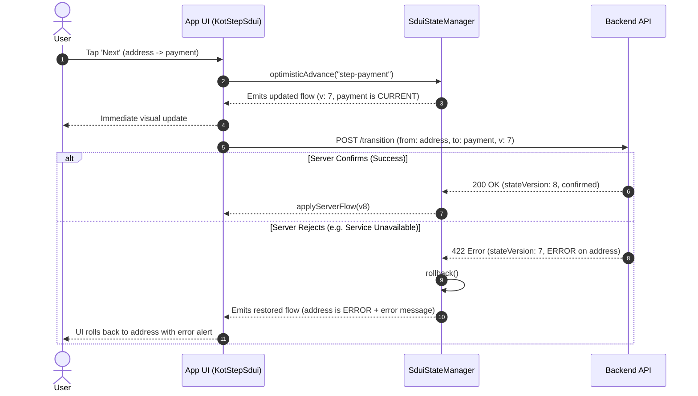

# KotStep SDUI (Server-Driven UI) — Master Architecture & Implementation Plan

## 1. Executive Summary & SDUI Mental Model

### What is SDUI?
In standard mobile/multiplatform apps, the UI is hardcoded in the client binary:
```
Client hardcodes: Step 1 (Cart) -> Step 2 (Address) -> Step 3 (Payment)
```
If business wants to add a "KYC Verification" or "Gift Option" step, change step order, or run an A/B test:
- Developers write code, test, create release build.
- Submit to App Store / Google Play review (takes hours or days).
- Wait weeks for users to update the app.

With **Server-Driven UI (SDUI)**:
```
Server sends JSON: [ { id: "cart" }, { id: "kyc" }, { id: "address" }, { id: "payment" } ]
KotStep renders UI directly from JSON!
```
- **Zero app release cycles:** Backend changes JSON; UI instantly updates for 100% of users across Android, iOS, Desktop, and Web.
- **Dynamic branching funnels:** Loan application adds "Guarantor Details" only if credit score is below threshold; checkout adds "Customs Declaration" only for international shipping.
- **A/B testing & Personalization:** Backend serves 3-step checkout to segment A, 5-step detailed checkout to segment B.
- **Live order tracking:** Backend pushes status updates (Placed -> Shipped -> Out for Delivery -> Delivered) over SSE / WebSocket or polling.

### KotStep's SDUI Selling Point
Most SDUI frameworks (Airbnb Epoxy, DivKit, Hyperview) are heavy, monolithic, and force you to rewrite your entire app architecture.
**KotStep SDUI is lightweight and purpose-built for Steppers:**
- **Zero friction:** Render a dynamic stepper with literally **1 line of Compose code**.
- **Works with any backend:** Bring your own network layer (Ktor, Retrofit, Apollo GraphQL, or plain WebSocket). Pass JSON string or Kotlin DTO to KotStep.
- **Zero changes to core `:kotstep` library:** SDUI is an optional add-on module (`:kotstep-sdui`) that builds directly on top of KotStep v3 DSL.

---

## 2. Developer Experience (DX) — Making It Effortless

We provide 3 levels of integration so any developer, regardless of SDUI experience, can implement it in minutes:

### Level 1: 1-Line Drop-in (Zero Boilerplate)
Pass JSON string directly from API response:
```kotlin
// In your Composable screen
KotStepSdui(
    json = responseJsonString,
    onStepClick = { stepId ->
        // Handle step click (e.g., navigate to screen)
        navController.navigate("step/$stepId")
    }
)
```

### Level 2: Standard App with Custom Icons & Actions
```kotlin
KotStepSdui(
    json = responseJsonString,
    iconResolver = { iconName ->
        when (iconName) {
            "shopping_cart" -> Icons.Default.ShoppingCart
            "local_shipping" -> Icons.Default.LocalShipping
            "payment" -> Icons.Default.Payment
            "check" -> Icons.Default.Check
            else -> null
        }
    },
    onAction = { action ->
        when (action.type) {
            SduiActionType.NAVIGATE -> navController.navigate(action.target)
            SduiActionType.CUSTOM -> analytics.track(action.target, action.params)
        }
    }
)
```

### Level 3: Reactive State Manager (Optimistic Updates, WebSocket Mutations & Rollback)
For apps with live updates, background sync, or optimistic state:
```kotlin
@Composable
fun OrderTrackingScreen(viewModel: TrackingViewModel) {
    val stateManager = viewModel.sduiManager

    KotStepSdui(
        manager = stateManager,
        iconResolver = AppIconResolver,
        onAction = { action -> viewModel.dispatch(action) }
    )
}
```

---

## 3. High-Level Architecture




### Core Architecture Rules:
1. **Core `:kotstep` purity:** Zero changes to existing public API. No serialization or JSON dependencies in `:kotstep`.
2. **Decoupled network:** `:kotstep-sdui` has NO HTTP or network dependencies. App fetches JSON and hands it to KotStep.
3. **Fault-tolerance:** If server sends unexpected/future fields, client parser ignores them (`ignoreUnknownKeys = true`). If server sends invalid hex colors, fallback colors are used instead of crashing.
4. **Clean boundary:** Lambdas and `ImageVector` never exist in JSON. JSON contains string keys, resolved client-side via registry interfaces with sensible defaults.

---

## 4. JSON Contract Specifications

KotStep SDUI supports two operational modes:
- **Mode A: Unified Payload (`SduiFlow`)** — Single self-contained JSON document. Best for 90% of REST APIs, funnels, and checkout flows.
- **Mode B: Split Config + State (`SduiFlowConfig` + `SduiFlowState`)** — Caches static flow structure and streams high-frequency progress/mutations via WebSocket/SSE.

---

### Mode A: Unified Payload (`SduiFlow`)

```json
{
  "$schema": "https://kotstep.dev/schema/v1/sdui-flow.json",
  "schemaVersion": "1.0",
  "flowId": "checkout-order-9876",
  "title": "Checkout",
  "stateModel": "SERVER_AUTHORITATIVE",
  "orientation": "HORIZONTAL",
  "currentStepId": "step-payment",
  "currentStepProgress": 0.5,
  "style": {
    "itemPaddingDp": 8,
    "showCheckMarkOnDone": true,
    "ignoreCurrentState": false,
    "stepStyle": {
      "todo":    { "colorHex": "#E0E0E0", "sizeDp": 28, "shape": "CIRCLE", "borderWidthDp": 0, "borderColorHex": null },
      "current": { "colorHex": "#1E88E5", "sizeDp": 28, "shape": "CIRCLE", "borderWidthDp": 2, "borderColorHex": "#1565C0" },
      "done":    { "colorHex": "#43A047", "sizeDp": 28, "shape": "CIRCLE", "borderWidthDp": 0, "borderColorHex": null },
      "error":   { "colorHex": "#E53935", "sizeDp": 28, "shape": "CIRCLE", "borderWidthDp": 2, "borderColorHex": "#B71C1C" },
      "locked":  { "colorHex": "#BDBDBD", "sizeDp": 28, "shape": "CIRCLE", "borderWidthDp": 0, "borderColorHex": null }
    },
    "lineStyle": {
      "todo":    { "lineColorHex": "#E0E0E0", "progressColorHex": "#E0E0E0", "thicknessDp": 2, "lengthDp": 24, "lineType": "SOLID", "progressType": "SOLID" },
      "current": { "lineColorHex": "#E0E0E0", "progressColorHex": "#1E88E5", "thicknessDp": 2, "lengthDp": 24, "lineType": "SOLID", "progressType": "SOLID" },
      "done":    { "lineColorHex": "#43A047", "progressColorHex": "#43A047", "thicknessDp": 2, "lengthDp": 24, "lineType": "SOLID", "progressType": "SOLID" }
    }
  },
  "steps": [
    {
      "id": "step-cart",
      "ordinal": 0,
      "state": "DONE",
      "indicator": {
        "type": "NUMBER",
        "value": "1"
      },
      "title": "Cart",
      "subtitle": "2 items ($45.00)",
      "leadingText": null,
      "isCollapsible": false,
      "action": {
        "type": "NAVIGATE",
        "target": "cart_summary"
      },
      "metadata": {
        "analyticsId": "checkout_cart"
      }
    },
    {
      "id": "step-address",
      "ordinal": 1,
      "state": "DONE",
      "indicator": {
        "type": "ICON",
        "value": "local_shipping"
      },
      "title": "Delivery",
      "subtitle": "Home (Express)",
      "leadingText": null,
      "isCollapsible": true,
      "action": {
        "type": "NAVIGATE",
        "target": "shipping_address"
      },
      "metadata": {
        "analyticsId": "checkout_delivery"
      }
    },
    {
      "id": "step-payment",
      "ordinal": 2,
      "state": "CURRENT",
      "indicator": {
        "type": "ICON",
        "value": "payment"
      },
      "title": "Payment",
      "subtitle": "Credit Card",
      "leadingText": null,
      "isCollapsible": false,
      "action": {
        "type": "NAVIGATE",
        "target": "payment_sheet"
      },
      "metadata": {
        "analyticsId": "checkout_payment"
      }
    },
    {
      "id": "step-review",
      "ordinal": 3,
      "state": "LOCKED",
      "indicator": {
        "type": "NUMBER",
        "value": "4"
      },
      "title": "Review",
      "subtitle": "Confirm order",
      "leadingText": null,
      "isCollapsible": false,
      "action": null,
      "metadata": {
        "analyticsId": "checkout_review"
      }
    }
  ]
}
```

---

### Step Element Semantics (Separating Indicator vs Labels)



A major flaw in naive stepper implementations is mixing up what goes **inside the indicator circle** vs **beside the step**. KotStep SDUI cleanly distinguishes them:

| JSON Field | Purpose | Where Rendered in KotStep |
|---|---|---|
| `indicator.type` + `value` | Number ("1"), Text ("A"), Icon ("cart"), or Custom | Inside the indicator shape (circle/square) |
| `title` | Main step name ("Delivery Address") | Step label (Trailing label slot) |
| `subtitle` | Secondary context ("2 items", "Arriving tomorrow") | Below title in trailing label slot |
| `leadingText` | Optional tag ("Step 1 of 4", "Optional") | Leading label slot (above or before indicator) |
| `state` | `TODO`, `CURRENT`, `DONE`, `ERROR`, `LOCKED`, `SKIPPED` | Drives visual styling & badge overlay |
| `errorMessage` | Reason when `state == "ERROR"` | Rendered in red under subtitle |

---

### Mode B: Dynamic Mutations (Real-time mid-flow updates)

When a customer changes a choice (e.g. selects "Pay with Crypto" or selects "Delivery to Germany"), the backend sends a mutation payload:

```json
{
  "flowId": "checkout-order-9876",
  "stateVersion": 4,
  "mutations": [
    {
      "type": "INSERT_STEP",
      "afterStepId": "step-address",
      "step": {
        "id": "step-customs",
        "ordinal": 2,
        "state": "TODO",
        "indicator": { "type": "ICON", "value": "document" },
        "title": "Customs Declaration",
        "subtitle": "Required for international shipping",
        "action": { "type": "NAVIGATE", "target": "customs_form" }
      }
    },
    {
      "type": "UPDATE_STEP",
      "stepId": "step-payment",
      "patch": {
        "subtitle": "Duties & Taxes included"
      }
    },
    {
      "type": "REMOVE_STEP",
      "stepId": "step-gift-options"
    }
  ]
}
```

---

## 5. Visual State Mapping (Handling `ERROR`, `LOCKED`, `SKIPPED`)



KotStep v3 core calculates step completion (`Todo`, `Current`, `Done`) based on `currentStep: () -> Float`.
How does `:kotstep-sdui` support `ERROR`, `LOCKED`, and `SKIPPED` without breaking or altering `:kotstep`?

### The Decorator Pattern:
1. **Normal Flow (`TODO`, `CURRENT`, `DONE`):**
   - KotStep renders indicator and tracks progress as normal.
   - `kotstep-sdui` supplies `step.title` (number/char) or `step.icon`, and populates `trailingLabel` with Title + Subtitle.

2. **`ERROR` State:**
   - Indicator uses `step.content = { SduiErrorIndicator() }` rendering an alert/warning icon with error red background.
   - `trailingLabel` displays the step title plus the `errorMessage` in red text below it with an optional retry prompt.

3. **`LOCKED` State:**
   - Indicator uses `step.content = { SduiLockIndicator() }` rendering a lock icon with disabled gray background.
   - Click listener is disabled (no-op).
   - Labels are rendered at 40% opacity.

4. **`SKIPPED` State:**
   - Indicator renders a dash/strikethrough icon or dimmed state.
   - `trailingLabel` displays title with a "(Skipped)" badge.

**Zero core changes required. 100% visual fidelity achieved through Compose slots.**

---

## 6. DTO Data Models & Serialization

All models live in `:kotstep-sdui:commonMain` and use `kotlinx.serialization`:

```kotlin
package com.binayshaw7777.kotstep.sdui.model

import kotlinx.serialization.SerialName
import kotlinx.serialization.Serializable

@Serializable
data class SduiFlow(
    val schemaVersion: String = "1.0",
    val flowId: String,
    val title: String? = null,
    val stateModel: SduiStateModel = SduiStateModel.SERVER_AUTHORITATIVE,
    val orientation: SduiOrientation = SduiOrientation.HORIZONTAL,
    val currentStepId: String,
    val currentStepProgress: Float = 0f,
    val stateVersion: Int = 1,
    val style: SduiStyle = SduiStyle(),
    val steps: List<SduiStep> = emptyList(),
    val flowStatus: SduiFlowStatus = SduiFlowStatus.IN_PROGRESS
)

@Serializable
data class SduiStep(
    val id: String,
    val ordinal: Int = 0,
    val state: SduiStepState = SduiStepState.TODO,
    val indicator: SduiIndicator = SduiIndicator(),
    val title: String,
    val subtitle: String? = null,
    val leadingText: String? = null,
    val errorMessage: String? = null,
    val isCollapsible: Boolean = false,
    val action: SduiAction? = null,
    val metadata: Map<String, String> = emptyMap()
)

@Serializable
data class SduiIndicator(
    val type: SduiIndicatorType = SduiIndicatorType.DEFAULT,
    val value: String? = null // Number "1", text "A", or icon name "cart"
)

@Serializable
data class SduiAction(
    val type: SduiActionType,
    val target: String,
    val params: Map<String, String> = emptyMap()
)

@Serializable
enum class SduiIndicatorType {
    @SerialName("DEFAULT") DEFAULT,
    @SerialName("NUMBER") NUMBER,
    @SerialName("TEXT") TEXT,
    @SerialName("ICON") ICON,
    @SerialName("CUSTOM") CUSTOM
}

@Serializable
enum class SduiStepState {
    @SerialName("TODO") TODO,
    @SerialName("CURRENT") CURRENT,
    @SerialName("DONE") DONE,
    @SerialName("ERROR") ERROR,
    @SerialName("LOCKED") LOCKED,
    @SerialName("SKIPPED") SKIPPED
}

@Serializable
enum class SduiStateModel {
    @SerialName("SERVER_AUTHORITATIVE") SERVER_AUTHORITATIVE,
    @SerialName("CLIENT_OPTIMISTIC") CLIENT_OPTIMISTIC,
    @SerialName("LOCAL_ONLY") LOCAL_ONLY
}

@Serializable
enum class SduiOrientation {
    @SerialName("HORIZONTAL") HORIZONTAL,
    @SerialName("VERTICAL") VERTICAL
}

@Serializable
enum class SduiFlowStatus {
    @SerialName("IN_PROGRESS") IN_PROGRESS,
    @SerialName("COMPLETED") COMPLETED,
    @SerialName("ABANDONED") ABANDONED,
    @SerialName("PAUSED") PAUSED
}

@Serializable
enum class SduiActionType {
    @SerialName("NAVIGATE") NAVIGATE,
    @SerialName("SUBMIT") SUBMIT,
    @SerialName("SKIP") SKIP,
    @SerialName("CUSTOM") CUSTOM
}
```

---

## 7. Dynamic State Machine (`SduiStateManager`)



`SduiStateManager` handles state updates, version conflict prevention, optimistic progression, and server rollbacks:

```kotlin
package com.binayshaw7777.kotstep.sdui.state

import com.binayshaw7777.kotstep.sdui.model.*
import kotlinx.coroutines.flow.MutableStateFlow
import kotlinx.coroutines.flow.StateFlow
import kotlinx.coroutines.flow.asStateFlow

class SduiStateManager(
    initialFlow: SduiFlow
) {
    private val _flow = MutableStateFlow(normalizeOrdinals(initialFlow))
    val flow: StateFlow<SduiFlow> = _flow.asStateFlow()

    private var lastConfirmedServerFlow: SduiFlow = _flow.value

    /**
     * Applies state received from the server.
     * Drops stale updates using version gating.
     */
    fun applyServerFlow(newFlow: SduiFlow): SduiApplyResult {
        if (newFlow.stateVersion < _flow.value.stateVersion) {
            return SduiApplyResult.Ignored("Stale version: ${newFlow.stateVersion} <= current ${_flow.value.stateVersion}")
        }
        val normalized = normalizeOrdinals(newFlow)
        lastConfirmedServerFlow = normalized
        _flow.value = normalized
        return SduiApplyResult.Applied
    }

    /**
     * Applies incremental mid-flow mutations.
     */
    fun applyMutations(mutations: List<SduiMutation>, newVersion: Int): SduiApplyResult {
        if (newVersion <= _flow.value.stateVersion) {
            return SduiApplyResult.Ignored("Stale mutation version: $newVersion")
        }
        var currentSteps = _flow.value.steps.toMutableList()
        var currentStyle = _flow.value.style

        for (mutation in mutations) {
            when (mutation) {
                is SduiMutation.InsertStep -> {
                    val index = currentSteps.indexOfFirst { it.id == mutation.afterStepId }
                    if (index != -1) currentSteps.add(index + 1, mutation.step)
                    else currentSteps.add(mutation.step)
                }
                is SduiMutation.RemoveStep -> {
                    currentSteps.removeAll { it.id == mutation.stepId }
                }
                is SduiMutation.UpdateStep -> {
                    val index = currentSteps.indexOfFirst { it.id == mutation.stepId }
                    if (index != -1) {
                        currentSteps[index] = mutation.patch.applyTo(currentSteps[index])
                    }
                }
                is SduiMutation.UpdateStyle -> {
                    currentStyle = mutation.patch.applyTo(currentStyle)
                }
            }
        }

        val updated = _flow.value.copy(
            stateVersion = newVersion,
            steps = currentSteps,
            style = currentStyle
        )
        _flow.value = normalizeOrdinals(updated)
        return SduiApplyResult.Applied
    }

    /**
     * Optimistically advances to the next step immediately.
     * Used in CLIENT_OPTIMISTIC mode before network confirmation.
     */
    fun optimisticAdvance(toStepId: String) {
        val current = _flow.value
        val targetStep = current.steps.find { it.id == toStepId } ?: return
        val updatedSteps = current.steps.map { step ->
            when {
                step.ordinal < targetStep.ordinal -> step.copy(state = SduiStepState.DONE)
                step.id == toStepId -> step.copy(state = SduiStepState.CURRENT)
                else -> step
            }
        }
        _flow.value = current.copy(
            currentStepId = toStepId,
            currentStepProgress = 0f,
            steps = updatedSteps
        )
    }

    /**
     * Rolls back optimistic state if server rejects or fails.
     */
    fun rollback() {
        _flow.value = lastConfirmedServerFlow
    }

    /**
     * Calculates the Float currentStep for KotStep v3 core.
     */
    fun computeCurrentStepFloat(): Float {
        val current = _flow.value
        val currentIndex = current.steps.indexOfFirst { it.id == current.currentStepId }
        if (currentIndex == -1) return 0f
        return currentIndex.toFloat() + current.currentStepProgress.coerceIn(0f, 0.999f)
    }

    private fun normalizeOrdinals(flow: SduiFlow): SduiFlow {
        val reindexed = flow.steps
            .sortedBy { it.ordinal }
            .mapIndexed { index, step -> step.copy(ordinal = index) }
        return flow.copy(steps = reindexed)
    }
}
```

---

## 8. Resolution Interfaces (Pluggable Assets & Composable Registry)

To avoid bundling heavy material icon libraries or forcing specific fonts, resolution is interface-driven with built-in fallbacks:

```kotlin
package com.binayshaw7777.kotstep.sdui.resolver

import androidx.compose.runtime.Composable
import androidx.compose.ui.graphics.Color
import androidx.compose.ui.graphics.vector.ImageVector

// 1. Icon Resolver: Maps JSON string key to Compose ImageVector
fun interface SduiIconResolver {
    fun resolve(iconName: String): ImageVector?
}

// 2. Content Resolver: Maps custom contentType string to Compose slot
fun interface SduiContentResolver {
    @Composable
    fun resolve(contentType: String, props: Map<String, String>): (@Composable () -> Unit)?
}

// 3. Color Resolver: Maps hex strings (e.g. "#1E88E5") to Compose Color
fun interface SduiColorResolver {
    fun resolve(hex: String): Color
}

// Built-in Default Color Resolver
object DefaultSduiColorResolver : SduiColorResolver {
    override fun resolve(hex: String): Color {
        return try {
            val cleanHex = hex.removePrefix("#")
            when (cleanHex.length) {
                6 -> Color(cleanHex.toLong(16) or 0xFF000000)
                8 -> Color(cleanHex.toLong(16))
                else -> Color.Gray
            }
        } catch (e: Exception) {
            Color.Gray
        }
    }
}

// Built-in Default Icon Resolver (Returns null, app supplies icons)
object DefaultSduiIconResolver : SduiIconResolver {
    override fun resolve(iconName: String): ImageVector? = null
}
```

---

## 9. Top-level Composable API (`KotStepSdui`)

```kotlin
package com.binayshaw7777.kotstep.sdui.ui

import androidx.compose.runtime.*
import androidx.compose.ui.Modifier
import com.binayshaw7777.kotstep.sdui.model.*
import com.binayshaw7777.kotstep.sdui.parser.SduiParser
import com.binayshaw7777.kotstep.sdui.resolver.*
import com.binayshaw7777.kotstep.sdui.state.SduiStateManager

/**
 * Convenience entrypoint: Renders SDUI Stepper directly from JSON string.
 */
@Composable
fun KotStepSdui(
    json: String,
    modifier: Modifier = Modifier,
    iconResolver: SduiIconResolver = DefaultSduiIconResolver,
    contentResolver: SduiContentResolver = SduiContentResolver { _, _ -> null },
    onStepClick: ((stepId: String) -> Unit)? = null,
    onAction: ((SduiAction) -> Unit)? = null
) {
    val flow = remember(json) { SduiParser.parseFlow(json) }
    val stateManager = remember(flow) { SduiStateManager(flow) }

    KotStepSdui(
        manager = stateManager,
        modifier = modifier,
        iconResolver = iconResolver,
        contentResolver = contentResolver,
        onStepClick = onStepClick,
        onAction = onAction
    )
}

/**
 * State-managed entrypoint: Full reactive support with SduiStateManager.
 */
@Composable
fun KotStepSdui(
    manager: SduiStateManager,
    modifier: Modifier = Modifier,
    iconResolver: SduiIconResolver = DefaultSduiIconResolver,
    contentResolver: SduiContentResolver = SduiContentResolver { _, _ -> null },
    onStepClick: ((stepId: String) -> Unit)? = null,
    onAction: ((SduiAction) -> Unit)? = null
) {
    val flow by manager.flow.collectAsState()
    val kotStepStyle = remember(flow.style, flow.orientation) {
        SduiStyleMapper.mapStyle(flow.style, flow.orientation)
    }

    KotStep(
        modifier = modifier,
        currentStep = { manager.computeCurrentStepFloat() },
        style = kotStepStyle
    ) {
        flow.steps.forEach { step ->
            when {
                // ERROR state override
                step.state == SduiStepState.ERROR -> {
                    step(
                        content = { SduiErrorBadge() },
                        trailingLabel = {
                            SduiStepLabel(
                                title = step.title,
                                subtitle = step.errorMessage ?: step.subtitle,
                                isError = true
                            )
                        },
                        onClick = {
                            onStepClick?.invoke(step.id)
                            step.action?.let { onAction?.invoke(it) }
                        },
                        isCollapsible = step.isCollapsible
                    )
                }

                // LOCKED state override
                step.state == SduiStepState.LOCKED -> {
                    step(
                        content = { SduiLockBadge() },
                        trailingLabel = {
                            SduiStepLabel(
                                title = step.title,
                                subtitle = step.subtitle,
                                isDimmed = true
                            )
                        },
                        onClick = { /* Locked: non-interactive */ },
                        isCollapsible = false
                    )
                }

                // Icon indicator
                step.indicator.type == SduiIndicatorType.ICON -> {
                    val vector = step.indicator.value?.let { iconResolver.resolve(it) }
                    step(
                        icon = vector ?: DefaultStepIcon,
                        trailingLabel = {
                            SduiStepLabel(title = step.title, subtitle = step.subtitle)
                        },
                        onClick = {
                            onStepClick?.invoke(step.id)
                            step.action?.let { onAction?.invoke(it) }
                        },
                        isCollapsible = step.isCollapsible
                    )
                }

                // Number / Text indicator
                step.indicator.type == SduiIndicatorType.NUMBER || step.indicator.type == SduiIndicatorType.TEXT -> {
                    step(
                        title = step.indicator.value ?: "${step.ordinal + 1}",
                        trailingLabel = {
                            SduiStepLabel(title = step.title, subtitle = step.subtitle)
                        },
                        onClick = {
                            onStepClick?.invoke(step.id)
                            step.action?.let { onAction?.invoke(it) }
                        },
                        isCollapsible = step.isCollapsible
                    )
                }

                // Default dot/check indicator
                else -> {
                    step(
                        content = null,
                        trailingLabel = {
                            SduiStepLabel(title = step.title, subtitle = step.subtitle)
                        },
                        onClick = {
                            onStepClick?.invoke(step.id)
                            step.action?.let { onAction?.invoke(it) }
                        },
                        isCollapsible = step.isCollapsible
                    )
                }
            }
        }
    }
}
```

---

## 10. Repository Strategy: Skills & Rules Architecture

To make KotStep development and consumption world-class for both AI agents and human engineers, we structure the documentation, skills, and rules into two clear tiers:

### 1. Core KotStep Skill & Rules (`kotstep-core`)
- **Location:** `~/.agents/skills/kotstep-core/SKILL.md` (and project rule `AGENTS.md`)
- **Scope:**
  - Compose Multiplatform rules (purity of `commonMain`, expect/actual guidelines).
  - KotStep v3 DSL structure (`KotStep`, `KotStepScope`, `KotStepStyle`).
  - Strict backward compatibility constraints (never break published v3 DSL).
  - UI testing patterns across Android, iOS, Desktop, and Web.

### 2. SDUI Specialized Skill & Rules (`kotstep-sdui`)
- **Location:** `~/.agents/skills/kotstep-sdui/SKILL.md`
- **Scope:**
  - SDUI JSON schema definitions and versioning guidelines.
  - State machine lifecycle, mutation handling, and optimistic updates.
  - Resolver implementations (wiring icons, analytics, navigation).
  - Backend integration recipes (sample JSON responses for Checkout, KYC, Order Tracking).

---

## 11. Implementation Roadmap

### Phase 1: Module Setup & Version Catalog (`:kotstep-sdui`)
- Add `kotlinx-serialization-json` to `gradle/libs.versions.toml`.
- Configure serialization plugin.
- Create `:kotstep-sdui` module targeting KMP (`commonMain`, `androidMain`, `iosArm64`, `desktopMain`, etc.).
- Add dependency `:kotstep-sdui` -> `:kotstep`.

### Phase 2: DTOs & JSON Parser
- Write all `@Serializable` data classes and enums.
- Implement `SduiParser` with `ignoreUnknownKeys = true` and `isLenient = true`.
- Implement unit tests with valid, partial, and malformed JSON payloads.

### Phase 3: Style & Color Mapper
- Implement `SduiStyleMapper` converting `SduiStyle` -> `KotStepStyle`.
- Implement `DefaultSduiColorResolver` supporting 6-char (`#RRGGBB`) and 8-char (`#AARRGGBB`) hex codes with fallback.
- Unit tests for color parsing and style conversion.

### Phase 4: State Machine & Mutations Engine
- Implement `SduiStateManager`.
- Implement version gating and ordinal re-normalization.
- Implement mutation operations: `INSERT_STEP`, `REMOVE_STEP`, `UPDATE_STEP`, `UPDATE_STYLE`.
- Unit tests for optimistic advance and rollback logic.

### Phase 5: Composable Renderer (`KotStepSdui`)
- Implement `KotStepSdui` composables (1-line drop-in and state-managed variant).
- Implement `SduiStepLabel` (rendering title, subtitle, and error message).
- Implement `SduiErrorBadge` and `SduiLockBadge`.
- Compose previews and shared screenshot/desktop tests.

### Phase 6: Sample Showcase in Demo App
- Add SDUI demo tab to `:app` sample.
- Interactive showcase:
  1. Instant JSON editor (edit JSON on device -> stepper updates live!).
  2. E-commerce Checkout with dynamic KYC step injection.
  3. Live Order Tracking with simulated server push mutations.

### Phase 7: Verification, Schema & Publishing
- Generate JSON Schema file (`kotstep-sdui-schema.json`) for server teams.
- Create `SKILL-kotstep-core.md` and `SKILL-kotstep-sdui.md`.
- Update docs and sample READMEs.
- Publish artifacts alongside `:kotstep`.
