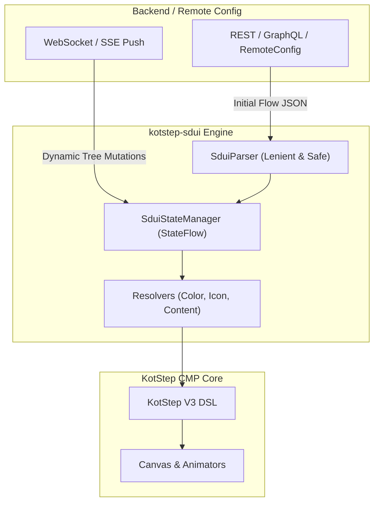

# Server-Driven UI (SDUI) Overview

The `:kotstep-sdui` module enables building dynamic, backend-driven onboarding, e-commerce checkout, KYC verification, and order tracking flows.

Instead of hardcoding stepper logic on the client and pushing App Store / Play Store updates whenever steps change, your backend supplies the flow definition as JSON.

---

## 🏗️ Architecture



---

## ⚡ Key Features

1. **Drop-in Simplicity**: Render directly from raw JSON string with `KotStepSdui(json = "...")`.
2. **Step State Lifecycle**: Built-in support for `TODO`, `CURRENT`, `DONE`, `ERROR`, `LOCKED`, and `SKIPPED` states.
3. **Optimistic Advances**: Advance immediately on the client when the user interacts, then confirm with the server.
4. **Instant Rollback**: If network or validation fails, rollback to last confirmed server state with zero UI glitching.
5. **Realtime Push Mutations**: Insert, remove, or patch steps on the fly via WebSockets, SSE, or push notifications.
6. **Multiplatform & Android-Free Core**: Runs natively on Android, iOS, Desktop, and Web.

---

## 🚀 1-Line Drop-in Quick Start

```kotlin
@Composable
fun OrderStatusScreen(flowJson: String) {
    KotStepSdui(
        json = flowJson,
        modifier = Modifier.fillMaxWidth().padding(16.dp),
        onStepClick = { stepId ->
            println("User clicked step: $stepId")
        }
    )
}
```
