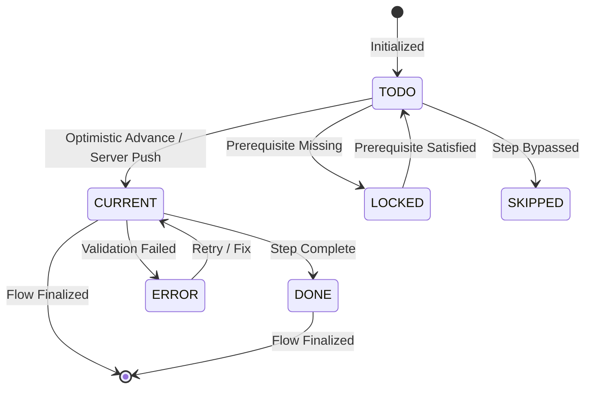

# State Management & Dynamic Mutations

The `SduiStateManager` powers the reactive lifecycle of Server-Driven steppers in Compose Multiplatform.

---

## State Lifecycle & Transitions



---

## Integrating SduiStateManager

```kotlin
@Composable
fun InteractiveCheckoutScreen(initialJson: String, viewModel: CheckoutViewModel) {
    val manager = remember { SduiStateManager(initialJson) }
    val flow by manager.flow.collectAsState()

    Column {
        KotStepSdui(
            manager = manager,
            modifier = Modifier.fillMaxWidth(),
            onStepClick = { stepId ->
                // 1. Optimistic Advance
                manager.optimisticAdvance(stepId)

                // 2. Call backend
                viewModel.submitStep(stepId, onFailure = {
                    // 3. Rollback on failure
                    manager.rollback()
                })
            }
        )

        // Previous / Next Buttons
        Row(modifier = Modifier.fillMaxWidth(), horizontalArrangement = Arrangement.SpaceBetween) {
            val currentIndex = flow.steps.indexOfFirst { it.id == flow.currentStepId }

            Button(
                onClick = {
                    if (currentIndex > 0) {
                        manager.optimisticAdvance(flow.steps[currentIndex - 1].id)
                    }
                },
                enabled = currentIndex > 0
            ) {
                Text("Previous")
            }

            Button(
                onClick = {
                    if (currentIndex < flow.steps.size - 1) {
                        manager.optimisticAdvance(flow.steps[currentIndex + 1].id)
                    }
                }
            ) {
                Text("Next Step")
            }
        }
    }
}
```

---

## Dynamic Tree Mutations

KotStep SDUI allows backend services to mutate the active stepper tree at runtime without redrawing or destroying existing state:

```kotlin
// Example: Insert a dynamic "Customs Declaration" step when international shipping is selected
val mutation = SduiMutation.InsertStep(
    step = SduiStep(
        id = "step_customs",
        state = SduiStepState.TODO,
        title = "Customs Declaration",
        subtitle = "Inspection pending",
        indicator = SduiIndicator(type = SduiIndicatorType.ICON, value = "assignment")
    ),
    afterStepId = "step_shipping"
)

manager.applyMutations(
    mutations = listOf(mutation),
    newVersion = flow.stateVersion + 1
)
```

### Supported Mutation Types

| Mutation | Description |
|---|---|
| `InsertStep(step, afterStepId)` | Inserts a new step into the flow and automatically re-indexes ordinals sequentially. |
| `RemoveStep(stepId)` | Removes an existing step by ID and re-normalizes ordinals. |
| `UpdateStep(stepId, patch)` | Modifies step title, subtitle, error message, or state. |
| `UpdateStyle(patch)` | Updates layout orientation, shapes, or color palettes. |

---

## Monotonic Version Conflict Safety

Both `applyServerFlow()` and `applyMutations()` enforce strict monotonic version gating:
- If incoming version `newVersion <= currentVersion`, the update is automatically discarded.
- Eliminates race conditions from out-of-order WebSocket frames, HTTP retries, or concurrent push notifications.
